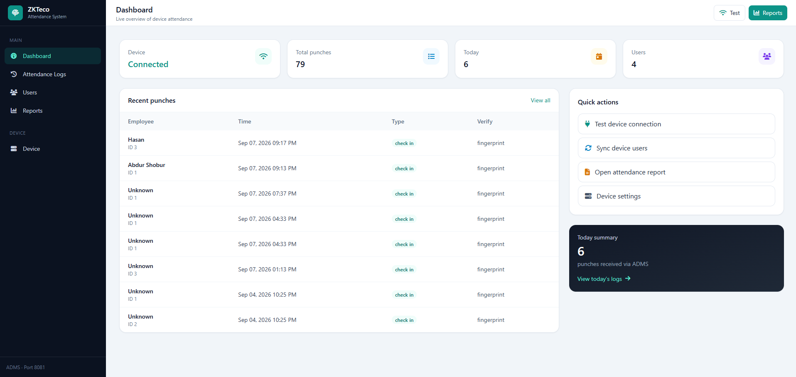

# ZKTeco Attendance System with Laravel



A comprehensive Laravel application for integrating with ZKTeco SpeedFace V3L biometric devices to manage employee attendance tracking in real-time.

## Features

-   **Real-time Biometric Integration**: Connect to ZKTeco SpeedFace V3L devices over Wi-Fi/LAN
-   **Automatic Log Synchronization**: Retrieve check-in/check-out logs automatically or manually
-   **User Mapping**: Map biometric device users to Laravel users
-   **Multiple Verification Types**: Support for fingerprint, face recognition, card, and password
-   **Real-time Dashboard**: Modern web interface with live updates
-   **Export Functionality**: Export attendance logs to CSV
-   **Auto-sync**: Automatic synchronization every 1 minute via Laravel scheduler
-   **Device Management**: Test connections, get device info, and manage users

## Requirements

-   PHP 8.1 or higher
-   Laravel 10.x
-   MySQL/PostgreSQL database
-   ZKTeco SpeedFace V3L device (or compatible)
-   Network connectivity to the biometric device

## Installation

### 1. Environment Configuration

Add the following to your `.env` file:

```env
# ZKTeco Device Configuration
ZKTECO_DEVICE_IP=192.168.1.201
ZKTECO_DEVICE_PORT=4370
ZKTECO_CONNECTION_TIMEOUT=30

# Auto Sync Settings
ZKTECO_AUTO_SYNC_INTERVAL=5
ZKTECO_MAX_LOGS_PER_SYNC=1000
ZKTECO_DELETE_AFTER_SYNC=false

# User Mapping
ZKTECO_USER_ID_FIELD=device_user_id
ZKTECO_ALTERNATIVE_FIELD=employee_id
ZKTECO_AUTO_CREATE_USERS=false

# Logging
ZKTECO_LOGGING_ENABLED=true
ZKTECO_LOG_CHANNEL=daily
ZKTECO_LOG_LEVEL=info
```

### 2. Database Setup

```bash
# Run migrations
php artisan migrate
```

### 3. Automatic Sync Setup (Optional)

To enable automatic attendance log synchronization every minute:

```bash
# Make the setup script executable
chmod +x setup-scheduler.sh

# Run the setup script for instructions
./setup-scheduler.sh
```

**Quick Setup:**
Add this cron job to run Laravel scheduler every minute:

```bash
# Open crontab
crontab -e

# Add this line (replace /path/to/project with your actual project path)
* * * * * cd /path/to/project && php artisan schedule:run >> /dev/null 2>&1
```

**Manual Testing:**

```bash
# Test the sync command
php artisan attendance:sync

# Test the scheduler
php artisan schedule:run

# View scheduled tasks
php artisan schedule:list
```

### 4. Device Network Configuration

1. **Connect your ZKTeco device to the network**:

    - Access device menu → Communication → Network
    - Set IP address (e.g., 192.168.1.201)
    - Set subnet mask and gateway
    - Enable network communication

2. **Test network connectivity**:

    ```bash
    ping 192.168.1.201
    ```

3. **Verify device port** (default: 4370):
    - Access device menu → Communication → Network → Port

## Usage

### 1. Access the Dashboard

Navigate to: `http://your-domain/attendance`

### 2. Test Device Connection

1. Click "Test Connection" button
2. Verify the device status shows "connected"
3. Check response time and connection details

### 3. Sync Attendance Logs

**Manual Sync:**

1. Click "Sync Logs" button
2. View sync results in the notification

**Automatic Sync:**

-   If you've set up the Laravel scheduler (see installation step 3), the system automatically syncs attendance logs every minute
-   No manual intervention required - logs are continuously synchronized in the background
-   Check the Laravel logs for sync status and any errors

### 4. User Mapping

To map biometric device users to Laravel users:

```php
// Add device_user_id to your users
User::create([
    'name' => 'John Doe',
    'email' => 'john@example.com',
    'device_user_id' => '123', // This should match the ID in biometric device
    'employee_id' => 'EMP001',
    'password' => bcrypt('password')
]);
```

### 5. API Endpoints

```php
// Test device connection
GET /attendance/test-connection

// Get device information
GET /attendance/device-info

// Sync logs manually
POST /attendance/sync

// Get attendance logs with filters
GET /attendance/logs?start_date=2024-01-01&end_date=2024-01-31&user_id=1

// Get user summary
GET /attendance/user/{userId}/summary?start_date=2024-01-01&end_date=2024-01-31

// Export logs to CSV
GET /attendance/export?start_date=2024-01-01&end_date=2024-01-31

// Real-time sync (for AJAX polling)
GET /attendance/realtime-sync
```

## Project Structure

```
app/
├── Http/Controllers/
│   └── AttendanceController.php    # Main controller for attendance management
├── Models/
│   ├── AttendanceLog.php           # Attendance log model
│   └── User.php                    # Extended user model with device mapping
└── Services/
    └── ZKTecoService.php           # Service class for device communication

config/
└── zkteco.php                      # ZKTeco configuration file

database/migrations/
├── create_attendance_logs_table.php
└── add_device_user_id_to_users_table.php

resources/views/attendance/
└── index.blade.php                 # Attendance dashboard

routes/
└── web.php                         # Attendance routes
```

## Troubleshooting

### Common Issues

1. **Connection Failed**

    - Verify device IP address and port
    - Check network connectivity
    - Ensure device is powered on
    - Verify firewall settings

2. **No Logs Syncing**

    - Check if device has attendance logs
    - Verify device time settings
    - Check Laravel logs for errors

3. **User Mapping Issues**
    - Ensure `device_user_id` field exists in users table
    - Verify device user IDs match database records
    - Check user mapping configuration

### Debug Mode

Enable detailed logging:

```env
ZKTECO_LOGGING_ENABLED=true
ZKTECO_LOG_LEVEL=debug
```

Check logs:

```bash
tail -f storage/logs/laravel.log
```

## Device Setup Guide

### ZKTeco SpeedFace V3L Configuration

1. **Initial Setup**:

    - Power on the device
    - Access admin menu (default: admin/123456)
    - Go to System → Time to set correct time

2. **Network Configuration**:

    - Menu → Communication → Network
    - Set static IP address
    - Configure subnet mask and gateway
    - Enable "Network Function"

3. **User Enrollment**:

    - Menu → User Management → New User
    - Assign unique user ID (this will be used for mapping)
    - Enroll fingerprint/face data
    - Set user privileges

4. **Attendance Settings**:
    - Menu → Attendance → Attendance Status
    - Configure work codes if needed
    - Set attendance rules

## License

This project is open-sourced software licensed under the [MIT license](https://opensource.org/licenses/MIT).

php artisan serve --host=0.0.0.0 --port=8081
